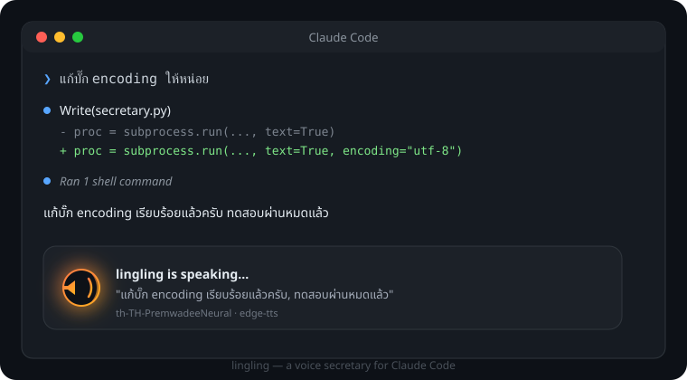

<p align="center">
  
</p>

<h1 align="center">lingling</h1>

<p align="center">
  <em>Claude ทำงานเสร็จ แล้วมันเล่าให้ฟังเอง — ไทยหรืออังกฤษตามที่มันตอบ</em>
</p>

<p align="center">
  
  
  
  
</p>

> **หมายเหตุ:** `assets/mockup.svg` ด้านบนเป็นภาพ mockup ชั่วคราว เดี๋ยวจะเปลี่ยนเป็นโลโก้จริงทีหลัง

---

คุณสั่งงาน Claude Code แล้วเดินไปชงกาแฟ กลับมาก็ต้องไล่อ่าน output ยาวๆ ว่ามันทำอะไรไปบ้าง

**lingling** แก้ปัญหานั้น: พอ Claude ทำงานเสร็จ มันจะปิดท้ายคำตอบด้วยบทสรุปหนึ่งบรรทัด แล้วอ่านบรรทัดนั้นออกเสียงให้ฟังทันที เหมือนมีเลขาส่วนตัวคอยรายงานผลงานให้ ไม่ต้องเหลือบมองจอเป็นระยะๆ อีกต่อไป

บรรทัดนั้นทำหน้าที่เป็น **transcript** ไปในตัว ใครไม่ได้อยู่ฟังก็กลับมาอ่านตามในแชทได้เลยว่าเสียงพูดอะไรไป

**สองภาษาอัตโนมัติ** — Claude ตอบไทยก็สรุปไทยแล้วพูดด้วยเสียงไทย ตอบอังกฤษก็สรุปอังกฤษแล้วพูดด้วยเสียงอังกฤษ ไม่ต้องสลับโหมดเอง

นอกจากนี้ยังพูดแจ้งเตือนตอน Claude ค้างรอ permission หรือรออินพุตจากคุณด้วย

## ก่อน / หลัง

**ก่อน** — Claude ตอบยาวๆ เต็มไปด้วย markdown, code block, technical jargon คุณต้องอ่านเองทั้งหมดเพื่อรู้ว่ามันทำอะไรไปแล้ว

**หลัง** — lingling สรุปให้เหลือหนึ่งถึงสองประโยคที่ฟังแล้วเข้าใจทันที พูดด้วยเสียงธรรมชาติในภาษาเดียวกับที่ Claude ตอบ เว้นจังหวะเหมือนคนพูดจริง ไม่ใช้ศัพท์ทางการ ไม่พยายามอ่านโค้ดหรือ URL ให้ปวดหัว

## จุดเด่น

- **สรุปอัตโนมัติทุกครั้งที่ Claude หยุดทำงาน** ผ่าน `Stop` hook ไม่ต้องสั่งเอง
- **สองภาษาในตัว** ตรวจจากคำตอบของ Claude เองว่าเป็นไทยหรืออังกฤษ แล้วเลือกภาษาสรุปกับเสียงพูดให้ตรงกัน
- **มี transcript ท้ายคำตอบทุกครั้ง** อ่านตามได้ในแชทถ้าไม่ได้อยู่ฟัง
- **แจ้งเตือนด้วยเสียง** เมื่อ Claude รอ permission หรือรออินพุตจากคุณ
- **เลือก TTS engine ให้เองอัตโนมัติ** ตามสิ่งที่มีในเครื่อง (ดูตารางด้านล่าง) หรือบังคับเองก็ได้
- **สรุปด้วย AI** ผ่าน API key หรือ subscription เดิม (`claude -p`) ไม่มี key ก็ใช้งานได้
- **จังหวะพูดเป็นธรรมชาติ** เว้นวรรคตามประโยค ไม่พูดรวดเดียวไม่มีจุดหยุดพัก ไม่ใช้ศัพท์ราชบัณฑิตย์แข็งๆ
- **ปิด/เปิดเสียงกลางทางได้** ด้วย `/lingling:mute` และ `/lingling:unmute`

## ติดตั้ง

### Claude Code

```
/plugin marketplace add vectorkub/lingling
```
```
/plugin install lingling@lingling
```

(ต้องส่งสองคำสั่งแยกกันคนละข้อความ)

### ทดสอบว่าใช้ได้

```bash
python scripts/secretary.py --mode test
```

จะบอกว่าตรวจเจอ TTS engine อะไร ใช้เสียงตัวไหนของแต่ละภาษา ใช้ตัวสรุปแบบไหน แล้วพูดทดสอบให้ฟังทั้งไทยและอังกฤษอย่างละประโยค

## transcript ท้ายคำตอบมาจากไหน

`UserPromptSubmit` hook แนบคำสั่งสั้นๆ เข้าไปทุกเทิร์น ให้ Claude ปิดท้ายคำตอบด้วยบรรทัดเดียวหน้าตาแบบนี้:

```
🔊 แก้บั๊กเรื่องภาษาเสร็จแล้วครับ, ตอนนี้เทสผ่านหมดทุกเคส
```

`Stop` hook แค่ดึงบรรทัดนั้นไปเข้า TTS ตรงๆ ได้ประโยชน์สองต่อ:

- **ไม่มีดีเลย์** ไม่ต้องเรียกโมเดลมาสรุปซ้ำหลังคำตอบจบ hook จึงเป็น `async` ที่ไม่หน่วง turn เลย
- **ภาษาตรงเสมอ** Claude เขียนบรรทัดนี้ด้วยภาษาเดียวกับที่มันตอบอยู่แล้ว ไม่ต้องเดา

ถ้าเทิร์นไหนไม่มีบรรทัดนี้ (เช่นเปิด `inject_instruction: false` หรือ Claude ข้ามไปเพราะตอบสั้นมาก)
สคริปต์จะถอยไปใช้ทางเดิมคือสรุปเองด้วยโมเดล แล้วเดาภาษาจากตัวคำตอบแทน

## ตัวสรุป (ทางสำรอง)

ใช้เฉพาะตอนไม่เจอบรรทัด 🔊 ในคำตอบ สคริปต์เลือกให้เองตามนี้ (ตั้ง `summarizer` ใน config เพื่อบังคับได้):

| โหมด | เงื่อนไข | ความเร็ว | ค่าใช้จ่าย |
|---|---|---|---|
| `api` | มี `ANTHROPIC_API_KEY` ใน env | ~1 วิ | ถูกมาก (Haiku, ~200 token/ครั้ง) |
| `cli` | มีคำสั่ง `claude` ในเครื่อง | ~3-5 วิ | ใช้โควตา subscription เดิม ไม่ต้องมี key |
| `none` | — | ทันที | ฟรี แต่จะอ่านข้อความดิบ ไม่ได้สรุป |

ไม่ว่าโหมดไหน prompt ที่ส่งไปสรุปจะเป็นภาษาเดียวกับคำตอบต้นทาง คำตอบอังกฤษได้บทสรุปอังกฤษ ไม่ใช่ไทย

โหมด `cli` เรียก `claude -p` พร้อม `--settings '{"disableAllHooks": true}'`
จุดนี้สำคัญมาก ถ้าไม่ปิด hook ใน session ลูก มันจะยิง Stop hook ซ้อนกลับมาเป็น loop ไม่รู้จบ

## เสียงพูด

เลือกอัตโนมัติตามลำดับ: Google → Azure → macOS `say` → edge-tts → Windows SAPI → espeak
ทุก engine มีเสียงคู่ไทย/อังกฤษ สลับให้เองตามภาษาของข้อความที่จะพูด

| engine | คุณภาพ | เสียงไทย | เสียงอังกฤษ | วิธีเปิดใช้ |
|---|---|---|---|---|
| `google` | ดีที่สุด | `th-TH-Neural2-C` | `en-US-Neural2-C` | `export GOOGLE_TTS_API_KEY=...` |
| `azure` | ดีมาก | `th-TH-PremwadeeNeural` | `en-US-JennyNeural` | `export AZURE_SPEECH_KEY=...` |
| `edge` | ดี ฟรี | `th-TH-PremwadeeNeural` | `en-US-AriaNeural` | `pip install edge-tts` |
| `say` | พอใช้ | `Kanya` | `Samantha` | macOS เท่านั้น ต้องลงเสียงไทยก่อน (ดูด้านล่าง) |
| `espeak` | หุ่นยนต์ | `th` | `en` | Linux: `apt install espeak-ng` |

**Windows:** ต้องมี Python จริงบนเครื่อง (python.org หรือ `winget install Python.Python.3.13`) — alias ของ Microsoft Store ใช้ไม่ได้ ไม่มีเสียงตอบสนองจริง แนะนำ `pip install edge-tts` เพื่อเสียง `th-TH-PremwadeeNeural` แทน SAPI ภาษาอังกฤษที่ติดมากับเครื่อง

**ลงเสียงไทยบน macOS:** System Settings → Accessibility → Spoken Content →
System Voice → Manage Voices → เลือก Thai (Kanya) แล้วดาวน์โหลด
ถ้ายังไม่ได้ลง สคริปต์จะ fallback ไปเสียง default แล้วเขียนเตือนไว้ใน log

ถ้าเป็น Linux ต้องมีตัวเล่นเสียงด้วย: `apt install mpg123`

## ตั้งค่า

สร้าง `~/.claude/thai-secretary.json` (ทุก key ไม่บังคับ ใส่เฉพาะที่อยากเปลี่ยน):

```json
{
  "enabled": true,
  "language": "auto",
  "notify_lang": "auto",
  "inject_instruction": true,
  "voice_engine": "auto",
  "summarizer": "auto",
  "model": "claude-haiku-4-5-20251001",
  "min_chars": 180,
  "skip_under_chars": 40,
  "max_spoken_chars": 600,
  "summarizer_timeout": 150,
  "say_voice": "Kanya",
  "say_voice_en": "Samantha",
  "speaking_rate": 0.85,
  "notify_sounds": true
}
```

- `language` — `auto` (ตามภาษาที่ Claude ตอบ), `th` หรือ `en` เพื่อล็อกไว้ภาษาเดียว
- `notify_lang` — ภาษาของเสียงแจ้งเตือน `auto` = ตามภาษาของคำตอบล่าสุด
- `inject_instruction` — ปิดเป็น `false` ถ้าไม่อยากให้มีบรรทัด 🔊 ท้ายคำตอบ (จะกลับไปสรุปเองแบบเดิม)
- `skip_under_chars` — ตอบสั้นกว่านี้เงียบไปเลย ไม่ต้องพูด
- `min_chars` — สั้นกว่านี้อ่านดิบ ไม่ต้องเสีย token เรียกโมเดลสรุป
- `speaking_rate` — น้อยกว่า 1.0 = ช้าลง, มากกว่า 1.0 = เร็วขึ้น
- เสียงของแต่ละ engine ตั้งแยกสองภาษาได้ด้วยคู่ `<engine>_voice` / `<engine>_voice_en`
  เช่น `"edge_voice_en": "en-US-GuyNeural"`
- override ชั่วคราวด้วย env ได้ เช่น `THAI_SECRETARY_ENABLED=false claude` หรือ `THAI_SECRETARY_LANGUAGE=en claude`

## คำสั่ง

| Command | หน้าที่ |
|---|---|
| `/lingling:mute` | ปิดเสียงเลขาส่วนตัวชั่วคราว |
| `/lingling:unmute` | เปิดเสียงกลับมา |

## เวลามีปัญหา

- `/hooks` ใน Claude Code — ดูว่า hook ลงทะเบียนแล้วจริงไหม มาจากไฟล์ไหน
- `~/.claude/thai-secretary.log` — บอกทุกขั้น ตั้งแต่ข้อความที่จะพูดไปจนถึง error ของ TTS
- สคริปต์ออกแบบให้ exit 0 เสมอ ต่อให้พังข้างในก็ไม่ทำให้ session ของคุณสะดุด
- เสียงพูดทับกันตอนสั่งงานรัวๆ — มีระบบหยุดเสียงเก่าก่อนพูดใหม่อยู่แล้ว
  ถ้ายังทับให้เช็คว่า `async: true` อยู่ครบทั้ง `Stop` และ `Notification`
- ไม่มีบรรทัด 🔊 ท้ายคำตอบ — `UserPromptSubmit` hook **ห้ามตั้ง** `async: true`
  เพราะ Claude Code ทิ้ง stdout ของ async hook ทั้งหมด คำสั่งจึงไปไม่ถึง Claude
- พูดผิดภาษา — ดูบรรทัด `stop[...] lang=...` ใน log ว่าตรวจได้อะไร
  ถ้าตรวจเพี้ยนบ่อยให้ตั้ง `language` เป็น `th` หรือ `en` ไปเลย
- **Windows:** ถ้าได้ยินเสียงอังกฤษแทนที่จะเป็นไทย มักเป็นเพราะ terminal ยังไม่เห็น PATH ใหม่หลังติดตั้ง Python —
  ปิดหน้าต่างเทอร์มินัลทั้งหมดแล้วเปิดใหม่ ไม่ใช่แค่พิมพ์ `claude` ซ้ำในหน้าต่างเดิม

## ข้อจำกัดที่ควรรู้

- **Claude Code** ใช้ได้เต็มที่ ทั้ง terminal, IDE extension และ Desktop app
- **Cowork** hook รันในแซนด์บ็อกซ์ที่แยกจากเครื่องคุณ เสียงจึงออกลำโพงคุณไม่ได้
  ถ้าจะทำต้องเปลี่ยนเป็น HTTP hook ยิงไปหา endpoint ที่เครื่องคุณแทน
- **Chat (web/มือถือ)** ไม่มีระบบ hook ทำได้แค่ระดับ skill/style ที่บังคับให้ปิดท้าย
  ด้วยบล็อกสรุปภาษาไทย แล้วใช้ read-aloud ของ OS อ่าน

## License

[GPL-3.0](LICENSE)
